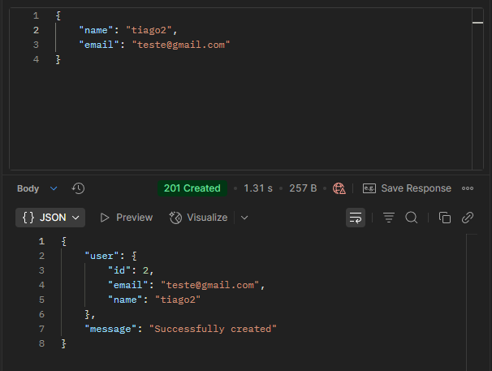
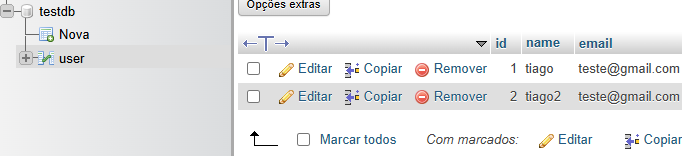

# CRUD_CSHARP

Uma API RESTful para gerenciamento de usuários, construída com ASP.NET Core 6.0 e Entity Framework Core. Permite realizar operações CRUD (Create, Read, Update, Delete) em um banco de dados MySQL.

```bash
ASP.NET Core 6.0
Entity Framework Core
Pomelo.EntityFrameworkCore.MySql (para MySQL)
Swashbuckle.AspNetCore (Swagger)
```

## Funcionalidades

- Criação de usuários
- Consulta de usuários
- Atualização de informações de usuários
- Exclusão de usuários

### Exemplo de requisição POST com Postman


### Exemplo de registro no banco de dados com phpMyAdmin
